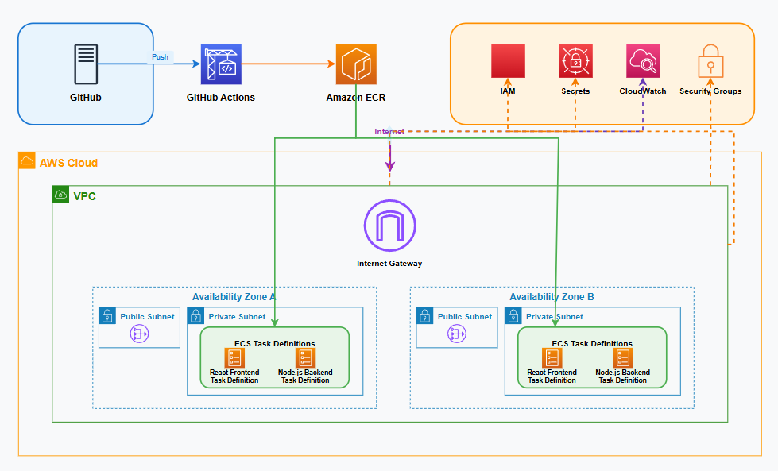

## Mục tiêu workshop

Trong workshop này, bạn sẽ học cách deploy một ứng dụng gồm nhiều container (frontend + backend) lên AWS ECS Fargate. Mục tiêu chính:

- Hiểu quy trình CI/CD cơ bản.
- Docker hóa ứng dụng frontend và backend.
- Sử dụng các dịch vụ AWS như ECR, ECS Fargate, và CloudWatch.

### Các bước chính
1. Tìm hiểu về CI/CD và containerization.
2. Docker hóa ứng dụng frontend và backend.
3. Đẩy container image lên Amazon ECR.
4. Deploy container lên ECS Fargate.
5. Tự động hóa quy trình với GitHub Actions.

## Kiến thức DevOps cốt lõi

### CI/CD
CI/CD (Continuous Integration/Continuous Deployment) là quy trình tự động hóa việc tích hợp và triển khai mã nguồn. Nó giúp giảm thiểu lỗi và tăng tốc độ phát triển phần mềm.

- **Continuous Integration**: Tích hợp mã nguồn thường xuyên để phát hiện lỗi sớm.
- **Continuous Deployment**: Tự động triển khai mã nguồn sau khi kiểm thử thành công.
- **Ví dụ**: Mỗi khi push lên nhánh `main`, GitHub Actions sẽ tự động thực hiện các bước: build image, push lên ECR, và deploy lên ECS Fargate.

### Containerization
Containerization là kỹ thuật đóng gói ứng dụng và các phụ thuộc vào một container. Docker là công cụ phổ biến nhất để thực hiện điều này.

- **Ưu điểm**: Dễ dàng triển khai, nhất quán giữa các môi trường.
- **Công cụ**: Docker, Kubernetes.

### ECS Fargate
ECS Fargate là dịch vụ của AWS giúp chạy container mà không cần quản lý server.

- **Ưu điểm**: Không cần quản lý cơ sở hạ tầng.
- **Ứng dụng**: Chạy các ứng dụng containerized.

## Công nghệ sử dụng

- **GitHub Actions**: Tự động hóa quy trình CI/CD. Workshop này sử dụng GitHub Actions thay vì AWS CodePipeline vì dễ tiếp cận với fresher.
- **Docker**: Đóng gói ứng dụng.
- **Amazon ECR**: Lưu trữ container image.
- **Amazon ECS Fargate**: Chạy container.
- **CloudWatch**: Theo dõi log và trạng thái hệ thống.

## Kiến trúc tổng quát

Dưới đây là sơ đồ kiến trúc tổng quát của hệ thống:

- **Frontend**: React app.
- **Backend**: Node.js hoặc Flask app.
- **ECR**: Lưu trữ container image.
- **ECS Fargate**: Chạy container.
- **Application Load Balancer**: Phân phối traffic.
- **CloudWatch**: Ghi log và giám sát.

> **Tip**: Đảm bảo bạn đã có tài khoản AWS và hiểu cơ bản về các dịch vụ AWS trước khi bắt đầu.
